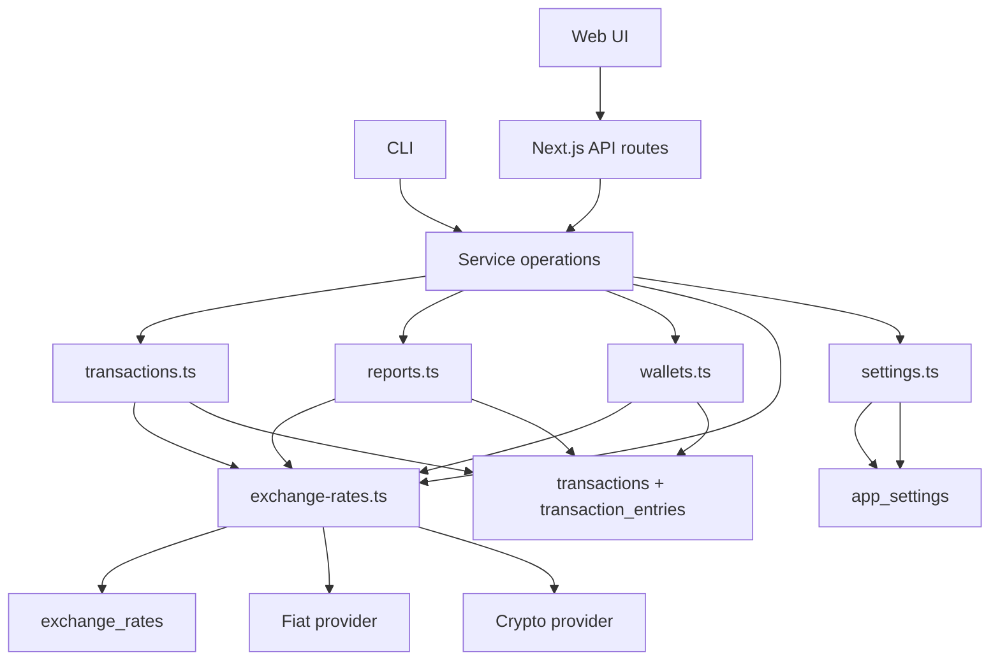

# Бэклог: курсы валют и кросс-валютная статистика

## Зачем это нужно

Система уже хранит деньги в нескольких валютах через `transaction_entries`, но не умеет:

- фиксировать стоимость транзакции в единой опорной валюте на момент записи;
- получать и кэшировать live и historical FX rates;
- корректно агрегировать расходы, доходы и балансы между разными валютами.

Цель этого бэклога: добавить слой курсов валют, исторические snapshot-поля в `transaction_entries` и read-path для отчётов и балансов в единой валюте без выноса бизнес-логики из `packages/service`.

## Целевой результат

- Каждая новая транзакция может иметь зафиксированный `snapshot` в опорной валюте системы.
- Исторические и текущие курсы доступны через отдельную service-операцию с кэшем в БД.
- Отчёты не смешивают разные валюты в один `SUM(...)` без явной конвертации.
- UI может показывать агрегаты в выбранной display currency.

## Зафиксированные допущения для v1

- Опорная snapshot-валюта системы: `USD`.
- Для интерфейса и отчётов используется отдельная mutable-настройка: `default display currency`.
- Если historical intraday rate недоступен у провайдера, для snapshot используется ближайший доступный daily rate.
- Для `income` и `expense` в не-`USD` валюте отсутствие курса считается ошибкой записи.
- Для cross-currency `transfer` пользовательский курс `amount/toAmount` считается источником истины для пары перевода.

## Ограничения текущей архитектуры

- В системе нет сущности пользователя, значит настройка базовой валюты пока должна быть app-wide, а не user-specific.
- Вся бизнес-логика обязана жить в `packages/service/src/operations`.
- Route handlers и CLI должны оставаться thin wrappers.
- Репозиторий использует `errore` и ожидает стиль `Error | T`, а не throw-first API.

## Документ по провайдерам

Подробный разбор провайдеров, тарифов, лимитов и стратегии для `fiat`, `crypto` и mixed-пар вынесен в [exchange-api.md](../../exchange-api.md).

## Словарь терминов

### Native amount

Исходная сумма записи в валюте самой транзакции. Например, `-10000 ARS`.

### Snapshot amount

Зафиксированная стоимость `native amount` в опорной snapshot-валюте системы на момент создания записи. Для v1 это сумма в `USD`.

### Snapshot currency

Валюта, в которой хранится `snapshot amount`. В этом бэклоге это фиксированная опорная валюта, а не пользовательская настройка.

### Snapshot rate

Курс, использованный для расчёта `snapshot amount`.

### Display currency

Валюта, в которой UI и отчёты хотят показывать агрегаты пользователю сейчас. Это mutable setting, не пригодное для immutable historical snapshot.

### Live rate

Текущий курс, полученный из внешнего провайдера и/или из свежего кэша.

### Historical rate

Курс на конкретный момент или дату в прошлом, используемый для historical conversion и backfill.

### FX cache

Таблица `exchange_rates` в PostgreSQL, где сохраняются полученные курсы для повторного использования.

### Cross-currency transfer

Перевод между кошельками, где debit entry и credit entry имеют разные валюты.

### Snapshot

Набор полей в `transaction_entries`, который замораживает стоимость записи в опорной валюте на момент создания.

### Valuation

Термин, который иногда используется для того же смысла, что и `snapshot`. В этом бэклоге не используется, чтобы не путать его с display-конвертацией.

## Архитектурная схема

## Потоки данных

### Write path

1. `createTransaction` валидирует входные данные.
2. До открытия SQL transaction запрашивается snapshot-rate, если он нужен.
3. В `transaction_entries` записываются `native amount` и `snapshot_*` поля.
4. Полученный курс кэшируется в `exchange_rates`.

### Read path

1. Отчёты и балансы читают `transaction_entries`.
2. Если `convertTo` совпадает со snapshot-валютой, используется `snapshot_amount`.
3. Если нужен другой target currency, сервис берёт historical или live rate из `exchange_rates` с fallback во внешний API.
4. Route handlers и CLI только пробрасывают параметры и результат.

## Структура бэклога

1. [01-schema-and-migrations.md](./01-schema-and-migrations.md)
2. [02-exchange-rate-service.md](./02-exchange-rate-service.md)
3. [03-transaction-snapshots.md](./03-transaction-snapshots.md)
4. [04-report-conversion.md](./04-report-conversion.md)
5. [05-total-balance.md](./05-total-balance.md)
6. [06-api-and-cli-adapters.md](./06-api-and-cli-adapters.md)
7. [07-web-ui.md](./07-web-ui.md)
8. [08-backfill.md](./08-backfill.md)
9. [09-verification.md](./09-verification.md)

## Порядок выполнения

1. Сначала схема и миграции.
2. Потом FX service.
3. Потом write-path для транзакций.
4. Потом read-path для отчётов и балансов.
5. Потом thin adapters.
6. Потом UI.
7. После этого backfill и проверка.
